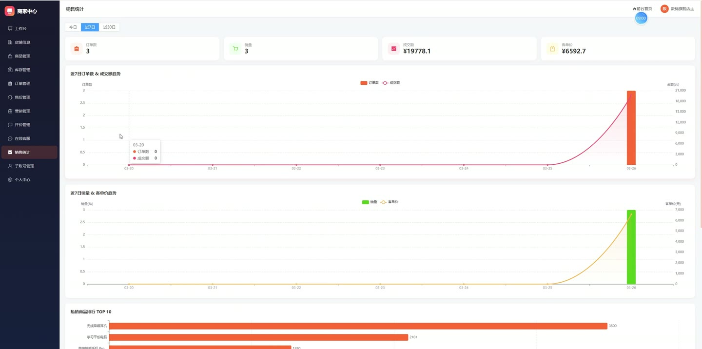
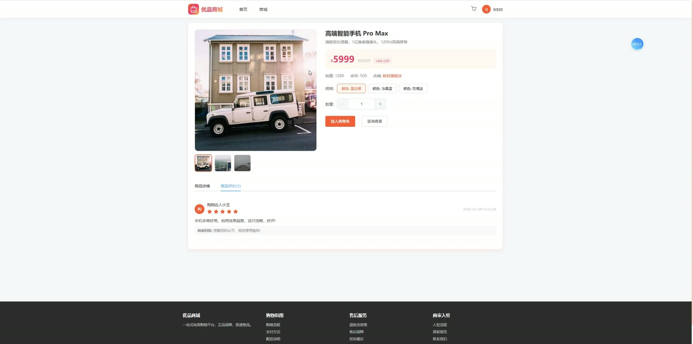
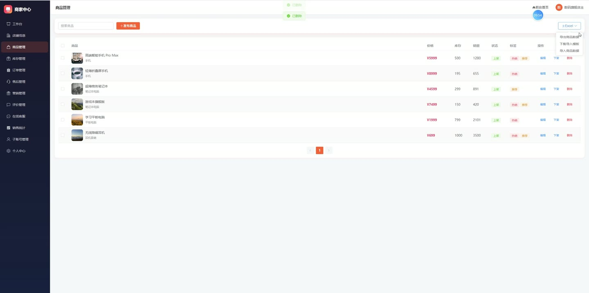
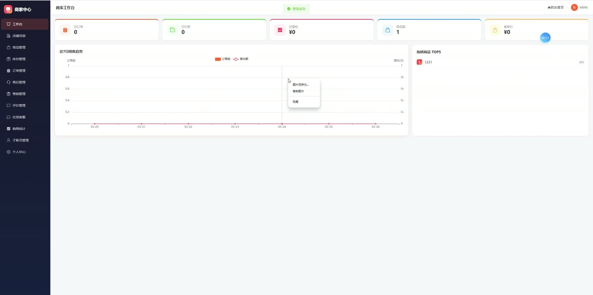
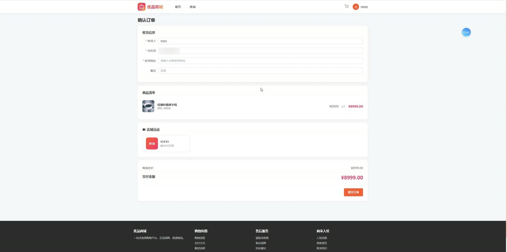

# (附文档)Springboot3+Vue3+MySQL 电商购物中商家管理平台

**技术栈**：Springboot3、Vue3、MySQL

### 系统简介

本系统是基于 Spring Boot 3 + Vue 3 + MySQL 构建的电商购物与商家管理平台，采用前后端分离架构。系统支持普通消费者浏览商品、下单购物、售后申请，同时为商家提供店铺管理、商品管理、订单处理、营销活动、客服聊天、子账号管理等完整功能，并配备管理员后台进行平台级审核与系统配置。
 
### 核心功能
 
### 普通用户端

 
- 浏览首页：查看轮播公告、热销/推荐/新品商品列表、分类导航、推荐商家 
- 商品搜索：按关键词、分类、商家筛选商品，支持按销量、价格升降序排序 
- 商品详情：查看商品基本信息、规格参数、用户评价列表（已审核通过的评价） 
- 购物车管理：添加商品至购物车（含规格选择）、修改数量、删除单品、清空购物车、查看购物车数量 
- 提交订单：从购物车勾选商品下单，填写收货人姓名/电话/地址及备注，支持选择优惠券和店铺活动 
- 订单支付：模拟支付操作，支付后更新订单状态并扣减库存、增加销量 
- 订单管理：查看个人订单列表（按状态筛选）、订单详情、确认收货、取消订单 
- 售后申请：对已支付订单提交售后单（含类型、原因、说明），系统自动关联商家 
- 优惠券领取：在店铺页面领取优惠券，查看已领取的优惠券列表及可用优惠券 
- 消息聊天：与商家在线聊天，发送文字消息，查看历史聊天记录和会话列表（含未读计数） 
- 个人中心：修改个人资料（昵称、头像、手机号、邮箱）、查看我的订单/售后/优惠券 
- 意见反馈：提交反馈内容，查看管理员回复
 
### 商家端

 
- 商品管理：发布新商品（含名称、描述、分类、价格、原价、主图、库存、库存预警）、编辑商品、删除商品、上下架商品 
- 商品规格管理：为商品添加多个规格（规格名、规格值、价格、库存），查看商品规格列表 
- 商品批量操作：通过 Excel 导入/导出商品数据，下载导入模板，批量修改商品状态/热销/推荐/库存/预警值 
- 库存预警：查看库存低于预警值的商品列表，快速修改库存量 
- 订单处理：查看本店订单列表（按状态筛选）、订单详情、发货（填写物流公司和单号）、完成订单 
- 售后处理：查看本店售后申请列表（按状态筛选）、审核售后单（通过/拒绝并填写回复），自动同步订单状态 
- 营销活动：创建满减/折扣活动（设置门槛、减免金额/折扣率、活动时间）、编辑/删除活动 
- 优惠券管理：创建店铺优惠券（满减券/折扣券，设置总量、门槛、折扣、有效期）、编辑/删除优惠券 
- 评价管理：查看本店商品评价列表，支持回复评价 
- 客服聊天：与用户在线聊天，查看会话列表（含未读消息数），设置快捷回复语（增删改） 
- 子账号管理：创建子账号（用户名、密码、昵称、手机号、权限）、编辑权限/信息、删除子账号、查看子账号操作日志 
- 店铺设置：编辑店铺信息（名称、描述、Logo、联系方式等），查看店铺详情 
- 物流模板：创建运费模板（名称、运费、排序、是否默认），设置默认模板 
- 数据统计：查看店铺经营数据概览（订单量、销售额等）
 
### 管理员端

 
- 商家管理：查看商家列表（按关键词/状态筛选）、审核商家入驻（通过/拒绝）、编辑商家信息 
- 商品审核：查看所有商品列表，审核待审核商品（通过/驳回），管理商品上下架状态 
- 订单监管：查看全平台订单列表（按用户/商家/状态筛选），查看订单详情 
- 售后监管：查看全平台售后申请列表，处理售后单（通过/拒绝） 
- 评价管理：查看全平台评价，审核评价状态（通过/隐藏），回复评价 
- 分类管理：管理商品分类树（添加/编辑/删除一级和二级分类，设置排序） 
- 公告管理：发布平台公告（标题、内容、状态），编辑/删除公告 
- 违禁词管理：添加/删除违禁词，列表展示所有违禁词 
- 系统日志：查看全平台操作日志（按用户筛选），查看用户反馈列表并回复 
- 权限管理：管理管理员账号及权限分配 
- 数据统计：查看平台整体数据（注册用户数、商家数、订单量、销售额等）
 
### 技术栈

 后端框架Spring Boot 3.x ORMMyBatis-Plus 权限认证JWT Token（基于请求属性传递用户ID和角色） 前端框架Vue 3 状态管理Pinia 构建工具Vite 数据库MySQL（含完整初始化脚本） Excel 处理EasyExcel（商品导入导出） 工具库Hutool（MD5加密）
 
### 交付内容

 
- 后端完整源码 
- 前端完整源码 
- 数据库初始化脚本 
- 万字文档

## 界面展示

---

## 获取完整源码 + 万字文档

本仓库为项目介绍页。**完整前后端源码、数据库初始化脚本、万字项目文档**，请加微信 `kangkangcode`，或访问 [codekk.top](http://codekk.top) 获取。

可作课程设计 / 毕业设计参考，支持远程部署调试。